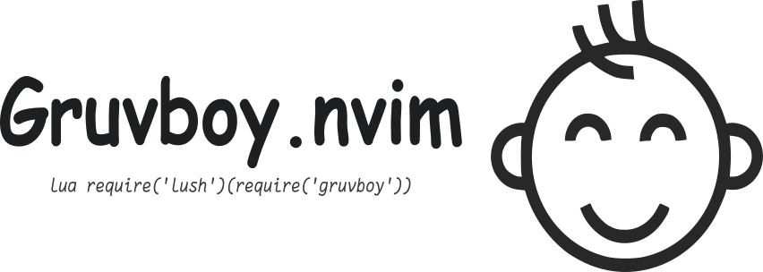

My own variation of gruvbox colorscheme made with [lush.nvim](https://github.com/rktjmp/lush.nvim).

# Screenshot

### dark mode

# Todo

- [x] gruvbox dark mode
- [ ] gruvbox light mode

# License

Source is available under the [Mit License](https://github.com/mnabila/gruvboy.nvim/blob/main/LICENSE)
